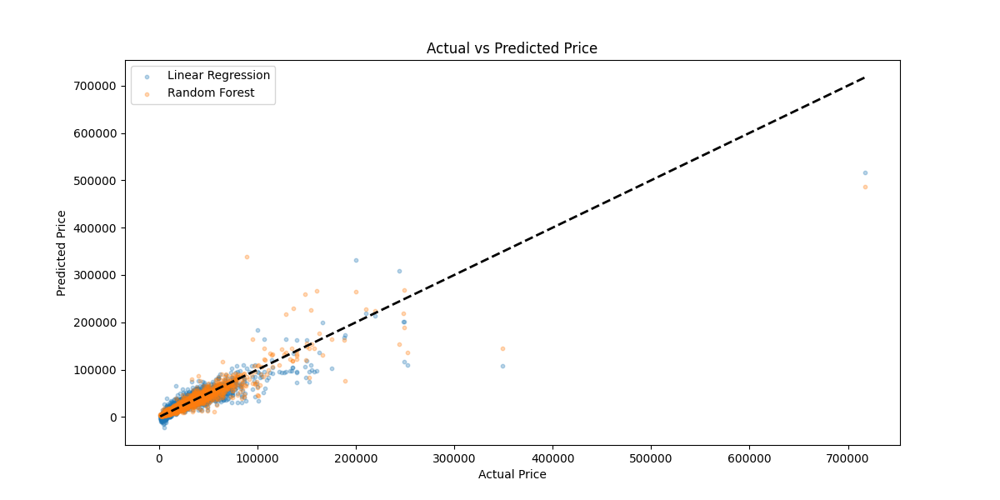

  

# ​ Hello, I'm Dilek | Ciao, sono Dilek

💡 **Big Data Analyst** | Specializing in **Data Analysis** & **Visualization**  
💻 Tools: Python | SQL | Power BI | Tableau | Excel | DAX | M Language

---

### ​ My Expertise / Le mie competenze
- 🧹 **Data Cleaning & Preparation / Pulizia dei Dati**  
  Handling missing values & outliers | Gestione valori mancanti e outlier  
- 📊 **Big Data Analysis / Analisi dei Big Data**  
  Extracting insights with SQL & Python | Insight con SQL & Python  
- 📈 **Data Visualization / Visualizzazione dei Dati**  
  Reports & dashboards in Power BI, Tableau | Report e dashboard in Power BI, Tableau  
- 🤖 **Machine Learning**  
  Predictive models | Modelli predittivi

---

### ​​ Technologies I Use / Tecnologie che utilizzo

    
    
    
    
  

---

- 🔹 [**Used Car Data Analysis**](https://github.com/dilekbrdkc/used-car-data-analysis)  
  End-to-end analysis of used car prices with Linear Regression, Random Forest, SQL and visualizations.  
  Analisi end-to-end dei prezzi delle auto usate con regressione lineare, Random Forest, SQL e visualizzazioni.  
  

- 🔹 [**HR Data Analysis**](https://github.com/dilekbrdkc/HR_Data_Analysis)  
  Study on employee turnover, job satisfaction, gender & education using IBM-based dataset.  
  Studio sul turnover dei dipendenti, soddisfazione lavorativa, genere e livello di istruzione su dataset creato da IBM.  
    
  

- 🔹 [**Clinical Trial Analysis**](https://github.com/dilekbrdkc/clinical_trial_analysis)  
  Statistical and visual analysis of Johnson & Johnson’s global clinical trials using **Python** and **Power BI**.  
  Analisi statistica e visuale delle sperimentazioni cliniche globali di Johnson & Johnson con **Python** e **Power BI**.  
  

---
 
### 🎯 Future Goals / Obiettivi futuri
- **Learning New Technologies**: Deepen your knowledge of data science and machine learning and learn new algorithms.
- **Big Data Management**: Learn more about big data tools like Hadoop and Spark and use them in projects.
- **Specializing in Data Analytics**: Deepen your understanding of the data analytics process and develop advanced projects.
- **Apprendimento di nuove tecnologie**: approfondire le conoscenze di data science e machine learning e apprendere nuovi algoritmi.
- **Gestione dei big data**: approfondire la conoscenza degli strumenti per i big data come Hadoop e Spark e utilizzarli nei progetti.
- **Specializzazione in analisi dei dati**: approfondire la comprensione del processo di analisi dei dati e sviluppare progetti avanzati.

---

### 📬 Contact / Contatti
- **E-mail**: dilekbdkc@gmail.com
- **LinkedIn**: [linkedin.com/in/dilek-bardakci-73228382](https://www.linkedin.com/in/dilek-bardakci-73228382/)

